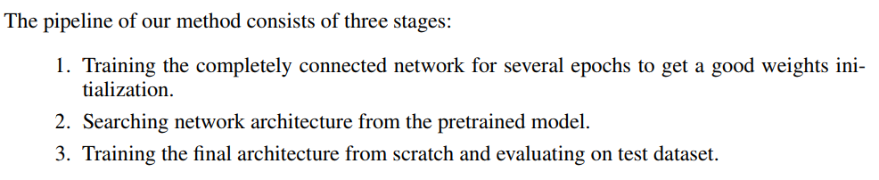

# You Only Search Once in Pytorch


모델 학습 명령어는 다음과 같습니다. 데이터는 fractal network와 마찬가지고 cifar10을 사용하였으며 augmentation 또한 적용하지 않았습니다.

```
python YOSO.py
```


첨부된 파일은 다음과 같습니다.
- YOSO.py : 실행 파일
- YOSO_module.py : YOSO.py 실행에 필요한 모듈
- ConvBlock.py : Convolution block 모음


### Default hyperparameter

- Operation epochs : 120
- Edge epochs : 120
- Data for training operation : 25000
- Data for training edge : 25000
- Stage : 4
- Block : 4
- Level : 8
- Operation : 2 (conv 3x3, conv 5x5)
- Conv filters in each Stage : 32, 64, 128, 256

기본 하이퍼 파라미터는 논문과 거의 비슷하게 설정하였습니다. 다만 Operation의 경우 max_pool, avg_pool을 논문 설명대로 똑같이 구현했을 때 block이 증가할수록 operation을 통과한 값들이 explode하는 현상이 발생합니다. 자세한 설명이 없어 일단 convolution block 2개로만 진행하였습니다. 


### 미완성 부분

현재 첨부한 코드는 아래 그림에서 2번 stage까지 입니다. 3번 full train의 경우 학습 소요시간이 상당히 길 것으로 예상됩니다.




추가적으로 구현이 필요한 부분은 다음과 같습니다.

- APG-NAG 하이퍼 파라미터 조절(edge clip이 좀 더 쉽게)
- FLOPs를 활용한 L1 regularization
- MAC(Memory Access Cost)를 활용한 L1 regularization
